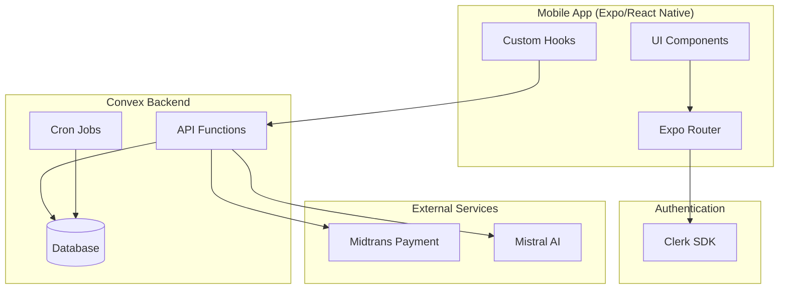
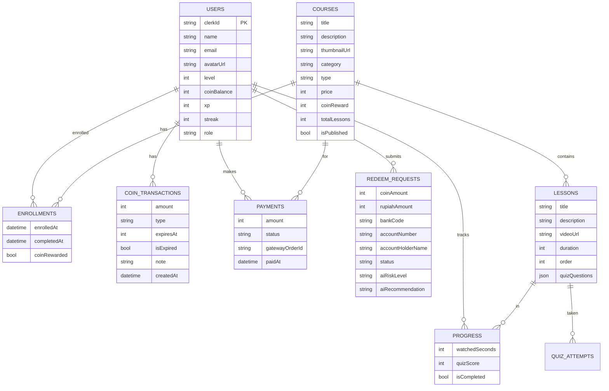

# Nexa Mobile App

A mobile learning platform built with Expo and React Native. Users can enroll in courses, track progress, earn coins, and redeem rewards.

## Tech Stack

- **Framework**: Expo SDK 54, React Native 0.81.5
- **Routing**: Expo Router (file-based)
- **Backend**: Convex (database, auth, server functions)
- **Auth**: Clerk
- **Styling**: TailwindCSS v4 + NativeWind
- **Build**: EAS Build (Android/iOS)

## Project Structure

```
apps/mobile/
├── app/                    # Expo Router pages
│   ├── (auth)/            # Login, register
│   ├── (tabs)/            # Main tab screens
│   ├── (admin)/           # Admin-only routes
│   ├── course/           # Course detail, lessons
│   ├── payment/          # Payment flow
│   └── admin/             # Legacy redirect
├── convex/                # Backend functions
│   ├── schema.ts          # Database schema
│   ├── courses.ts         # Course queries/mutations
│   ├── lessons.ts         # Lesson queries
│   ├── payments.ts        # Payment handling
│   ├── users.ts           # User management
│   ├── coins.ts           # Coin system
│   ├── gamification.ts    # Badges, achievements
│   ├── progress.ts        # Learning progress
│   └── aiInvestigation.ts # AI risk analysis
├── components/            # Reusable UI components
├── hooks/                 # Custom React hooks
├── constants/            # App constants
└── assets/                # Fonts, images
```

## Quick Start

```bash
cd apps/mobile

# Install dependencies
npm install

# Start development
npx expo start        # dev server
npx expo start --android
npx expo start --ios
npx expo start --web

# Lint & typecheck
npx expo lint
npx tsc --noEmit
```

## Backend (Convex)

```bash
# Local development
npm run dev        # runs npx convex dev

# Deploy to production
npm run deploy     # runs npx convex dev && npx convex deploy
```

Convex URL: `https://limitless-ermine-877.convex.cloud`

## EAS Build

```bash
# Android builds
eas build -p android --profile development   # dev APK
eas build -p android --profile preview       # internal
eas build -p android --profile production    # production

# Submit to Play Store
eas submit -p android --latest
```

## Routes Overview

| Route | Description |
|-------|-------------|
| `/login` | Authentication (Clerk) |
| `/register` | User registration |
| `/(tabs)` | Tab navigation (Home, Courses, Wallet, Profile) |
| `/course/[id]` | Course details |
| `/course/lesson/[id]` | Lesson player with video/quiz |
| `/payment/[courseId]` | Midtrans payment |
| `/admin/redeem` | Admin: redeem request management |

### Admin Routes

Admin panel uses nested stack → tabs pattern:
- `/(admin)/redeem` → redirects to `/admin/redeem/admin-tabs`
- Admin tabs: All, Pending, Profile

## Architecture Diagram



## Database Schema



## Redemption Flow

```mermaid
flowchart TD
    User[User] -->|Submit redeem request| Submit[POST /redeemRequest]
    Submit --> Convex[Convex Action]
    Convex -->|Save request| DB[(Database)]
    DB -->|Status: pending| PendingCheck{Pending?}
    
    PendingCheck -->|Yes| AI[Mistral AI Investigation]
    AI -->|Analyze| Risk[Risk Analysis]
    Risk -->|Save AI fields| DB
    
    DB -->|Admin reviews| AdminReview{Admin Action}
    AdminReview -->|Approve| Approve[PATCH /approve]
    AdminReview -->|Reject| Reject[PATCH /reject]
    
    Approve -->|Create payment| Midtrans[Midtrans Snap]
    Midtrans -->|Payment link| User
    
    User -->|Complete payment| Confirm[confirmRedeemPayment]
    Confirm -->|Disburse| Bank[Bank Transfer]
    Bank -->|Complete| Done[redeemRequests: disbursed]
    
    Reject -->|Notify| User

## Features

- **Courses**: Browse, enroll, track progress
- **Lessons**: Video player with quiz completion
- **Coins**: Earn from lessons, spend on rewards
- **Redemption**: Request rewards, admin approval flow
- **AI Investigation**: Mistral AI analyzes redeem requests for risk

## Environment

Copy `.env.example` to `.env.local` for local development.

## Key Conventions

- **Duration**: Stored in seconds, display as minutes (`Math.ceil(duration / 60)`)
- **Badges**: FREE (`#FFFBEB`), PREMIUM (`#FEF3C7`), Coin (`#FFC800`)
- **Payment**: Bank Transfer, GOPAY, OVO, QRIS via Midtrans

## Typography

```tsx
const TYPOGRAPHY = {
  h1: { fontFamily: 'SpaceGrotesk-Bold', fontWeight: '700' },
  h2: { fontFamily: 'nimbus-mono.regular', fontWeight: '400' },
  h3: { fontFamily: 'LiberationSans-Regular', fontWeight: '400' },
};
```

## Gotchas

- Route conflicts: Expo Router matches `page.tsx` before `(group)/page.tsx`
- Modal tab bars: Use Stack wrapper for transparent modals
- Hardcoded credentials in `app_providers.tsx` (not env-driven)
- Fonts bundled locally in `assets/Fonts/` (not CDN)

## Contributing

1. Create a feature branch
2. Make changes with lint/typecheck passing
3. Submit PR for review